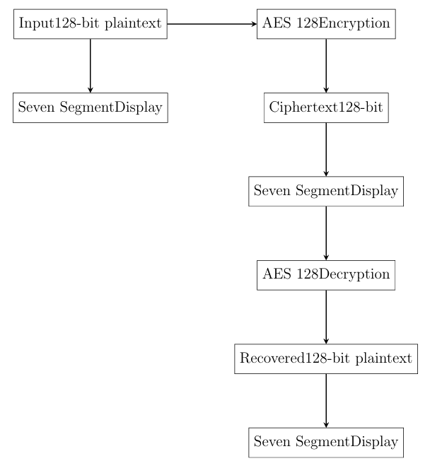

# 🔐 AES-128 Encryption and Decryption on FPGA (Basys3)

This project implements AES-128 encryption and decryption using Verilog, deployed on a Basys3 FPGA. It demonstrates secure data processing with visual output via a 7-segment display, simulating a complete encryption-decryption cycle using hardware-accelerated logic.

---

## 📌 Abstract

In the era of digital communication, data security has become a critical concern across sectors such as finance, defense, healthcare, and personal computing.

This project focuses on hardware implementation of AES-128 cryptography using FPGAs. Unlike software implementations that may suffer from latency and certain vulnerabilities, FPGA-based designs offer high throughput and enhanced physical security.

The AES core includes:

- AES-128 Encryption & Decryption modules
- Modular, pipelined architecture
- 7-Segment display interface for output visualization
- Simulated using Verilog testbenches and deployed on a Basys3 FPGA

---

## 🧠 Design Methodology

The AES system is designed with the following modules:

- ✅ **AES Encryption Module**: Accepts 128-bit plaintext and a secret key, outputs ciphertext. Implements all AES transformations (SubBytes, ShiftRows, MixColumns, and AddRoundKey) across 10 rounds.
- ✅ **AES Decryption Module**: Recovers plaintext from ciphertext via inverse AES transformations (InvSubBytes, InvShiftRows, InvMixColumns, and AddRoundKey).
- ✅ **Display Module**: 7-segment display to show data in real-time.
- ✅ **Simulated PC-FPGA Communication**: Verified via testbenches and waveform inspection in Vivado/ModelSim.

> The design supports: Pre-reset input display → Ciphertext display after encryption → Recovered plaintext display after decryption.

### 📊 Block Diagram



---

## 🧾 Top Module: `AES_Display_Top`

The top-level module integrates AES operations with display logic on Basys3. It includes FSM-based state control, Verilog-based segment multiplexing, and a timed visual update loop.

Key features:
- Internal 128-bit embedded plaintext: `localparam [127:0] EMBEDDED_PLAINTEXT = 128’h00112233445566778899aabbccddeeff`
- Intermediate registers to store ciphertext and decrypted (regenerated) plaintext
- State-controlled encryption and decryption triggers
- Segment refresh using counters for multiplexing
- Switch-controlled data display to toggle between input plaintext, ciphertext, or decrypted output

> **Note:** Dash patterns are used for visual separation of cycles.

---

## 🔧 FPGA Synthesis and Implementation

> *Vivado project synthesized & implemented for Basys3 FPGA board*

- **Target Device:** Basys3 Artix-7 FPGA
- **Clock Frequency:** 100 MHz
- **Simulation Tools:** Vivado (Xilinx), ModelSim
- **Verification:** Functional simulation using waveform and display output
- **Synthesis Process**:
  - The synthesized design was converted into a bitstream file.
  - Using a USB interface, the bitstream was programmed into the Basys3 FPGA.
  - Onboard components such as switches and the 7-segment display were mapped to input/output ports in the Verilog code for real-time interaction.

### Simulation and Functional Verification
- Test vectors with known plaintext, key, and ciphertext values (e.g., from NIST standards) were used to validate correctness.
- `display`, `monitor`, and waveform viewers traced signal transitions and intermediate values.
- The encryption module’s output was fed into the decryption module to confirm reversibility.

📷 Vivado Implementation Snapshot


---

## 🛠️ Working Explanation

The complete working process of the AES cryptography project on the FPGA is as follows:
1. At startup, the system loads the initial plaintext and key either from hardcoded values (`128’h00112233445566778899aabbccddeeff`) or from switch inputs.
2. The encryption module processes the data using AES round functions to generate a 128-bit ciphertext.
3. The ciphertext is passed internally to the decryption module.
4. The decryption module uses the same key schedule in reverse, applying inverse AES transformations to retrieve the original plaintext.
5. A display selector (controlled by switches) allows users to view:
   - The original plaintext input
   - The encrypted ciphertext output
   - The decrypted plaintext (reconstructed)
6. The 7-segment displays update dynamically to show the selected data in hexadecimal format.

This architecture verifies the mathematical accuracy of AES and demonstrates the capability of FPGAs to implement secure cryptographic systems in hardware. Real-time data monitoring and switching between display modes enhance understanding and visualization of the encryption-decryption process.

---

## 📟 Output Scenarios

| Condition               | Output Description                           | Screenshot |
|------------------------|-----------------------------------------------|------------|
| 🔁 Pre-reset           | Display shows dashes or default state (8888)  | ✅ Included |
| 🔁 Input display       | Display cycles through input 128-bit data     | ✅ Included |
| 🔐 StartEncrypt High   | AES encrypts data and shows ciphertext        | ✅ Included |
| 🔓 StartDecrypt High   | Ciphertext is decrypted to original plaintext | ✅ Included |

> Below is a combined capture of display outputs under different states:


### Input and Output Display Mechanism
- **Input Data**:
  - The plaintext input (128-bit) can be hardcoded in simulation or configured through switches during hardware testing.
  - The cipher key is either predefined or loaded manually.
- **Output Visualization**:
  - **Encrypted Data (Ciphertext)**: Stored and displayed on the 7-segment display post-encryption.
  - **Decrypted Data (Recovered Plaintext)**: Displayed to verify the correctness of the AES flow.
- **Switch-Controlled Data Display**:
  - A specific set of switches toggles between displaying the input, ciphertext, or decrypted output, enabling dynamic observation of all stages.

---

## 🗂️ Project Structure

```
AES_FPGA/
│
├── src/                     # Verilog RTL files
├── constraints/             # Basys3 XDC file
├── images/                  # Diagrams & Output screenshots
│   ├── design_methodology.png
│   ├── implementation.png
│   └── outputs1.png
│   └── outputs2.png
└── README.md
```

---

## 📈 Performance Goals

- ✅ High throughput hardware-based AES encryption
- ✅ Real-time 7-segment visualization
- ✅ Minimal power and latency on Basys3

---

## 🤝 Acknowledgements

- Vivado by Xilinx
- Digital Design Concepts from FPGA4Student
- Basys3 Artix-7 board from Digilent

---

## 📌 License

This project is released under the MIT License.
