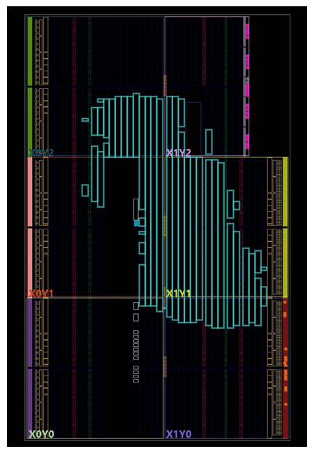
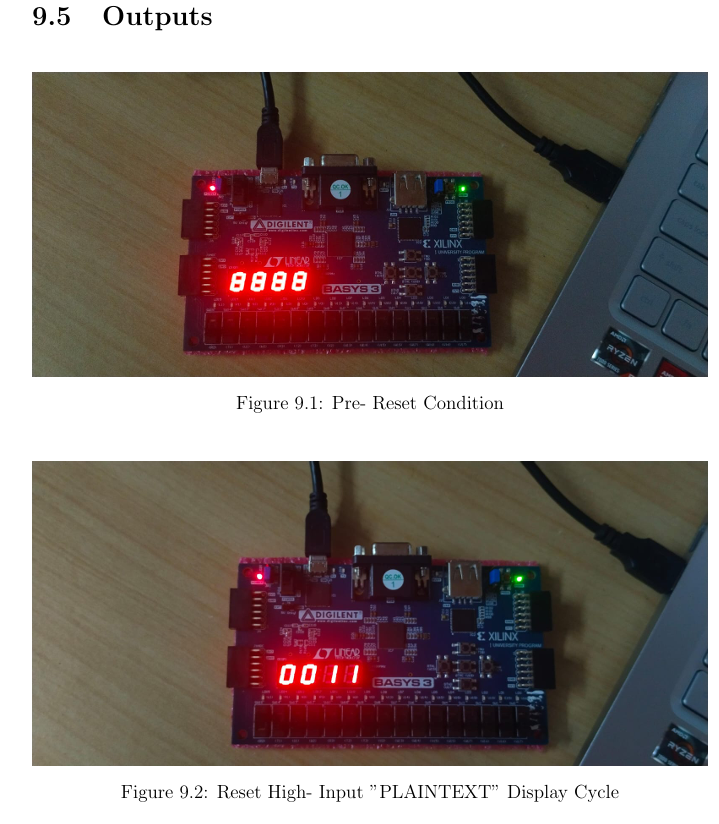
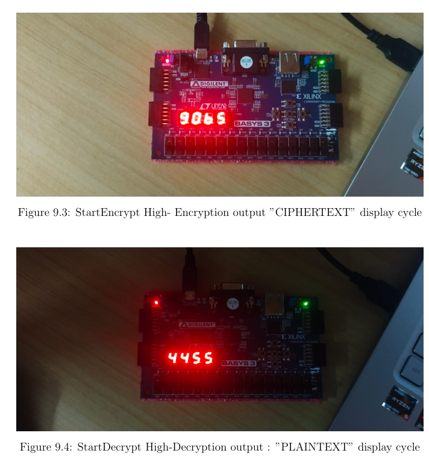

# 🔐 AES-128 Encryption and Decryption on FPGA (Basys3)

This project implements AES-128 encryption and decryption using Verilog, deployed on a Basys3 FPGA. It demonstrates secure data processing with visual output via a 7-segment display, simulating a complete encryption-decryption cycle using hardware-accelerated logic.

---

## 📌 Abstract

In the era of digital communication, data security has become a critical concern across sectors such as finance, defense, healthcare, and personal computing.

This project focuses on hardware implementation of AES-128 cryptography using FPGAs. Unlike software implementations that may suffer from latency and certain vulnerabilities, FPGA-based designs offer high throughput and enhanced physical security.

The AES core includes:

- AES-128 Encryption & Decryption modules
- Modular, pipelined architecture
- 7-Segment display interface for output visualization
- Simulated using Verilog testbenches and deployed on a Basys3 FPGA

---

## 🧠 Design Methodology

The AES system is designed with the following modules:

- ✅ **AES Encryption Module**: Accepts 128-bit plaintext and a secret key, outputs ciphertext.
- ✅ **AES Decryption Module**: Recovers plaintext from ciphertext via inverse AES transformations.
- ✅ **Display Module**: 7-segment display to show data in real-time.
- ✅ **Simulated PC-FPGA Communication**: Verified via testbenches and waveform inspection in Vivado/ModelSim.

> The design supports: Pre-reset input display → Ciphertext display after encryption → Recovered plaintext display after decryption.

### 📊 Block Diagram


---

## 🧾 Top Module: `AES_Display_Top`

The top-level module integrates AES operations with display logic on Basys3. It includes FSM-based state control, Verilog-based segment multiplexing, and a timed visual update loop.

Key features:
- Internal 128-bit embedded plaintext
- State-controlled encryption and decryption triggers
- Segment refresh using counters for multiplexing

> **Note:** Dash patterns are used for visual separation of cycles.

---

## 🔧 FPGA Synthesis and Implementation

> *Vivado project synthesized & implemented for Basys3 FPGA board*

- **Target Device:** Basys3 Artix-7 FPGA
- **Clock Frequency:** 100 MHz
- **Simulation Tools:** Vivado (Xilinx), ModelSim
- **Verification:** Functional simulation using waveform and display output

📷 Vivado Implementation Snapshot



---

## 📟 Output Scenarios

| Condition               | Output Description                           | Screenshot |
|------------------------|-----------------------------------------------|------------|
| 🔁 Pre-reset           | Display shows dashes or default state (8888)  | ✅ Included |
| 🔁 Input display       | Display cycles through input 128-bit data     | ✅ Included |
| 🔐 StartEncrypt High   | AES encrypts data and shows ciphertext        | ✅ Included |
| 🔓 StartDecrypt High   | Ciphertext is decrypted to original plaintext | ✅ Included |

> Below is a combined capture of display outputs under different states:



---

## 🗂️ Project Structure

```
AES_FPGA/
│
├── src/                     # Verilog RTL files
├── constraints/             # Basys3 XDC file
├── images/                  # Diagrams & Output screenshots
│   ├── design_methodology.png
│   ├── implementation.png
│   └── outputs1.png
│   └── outputs2.png
└── README.md
```

---

## 📈 Performance Goals

- ✅ High throughput hardware-based AES encryption
- ✅ Real-time 7-segment visualization
- ✅ Minimal power and latency on Basys3

---

## 🤝 Acknowledgements

- Vivado by Xilinx
- Digital Design Concepts from FPGA4Student
- Basys3 Artix-7 board from Digilent

---

## 📌 License

This project is released under the MIT License.
